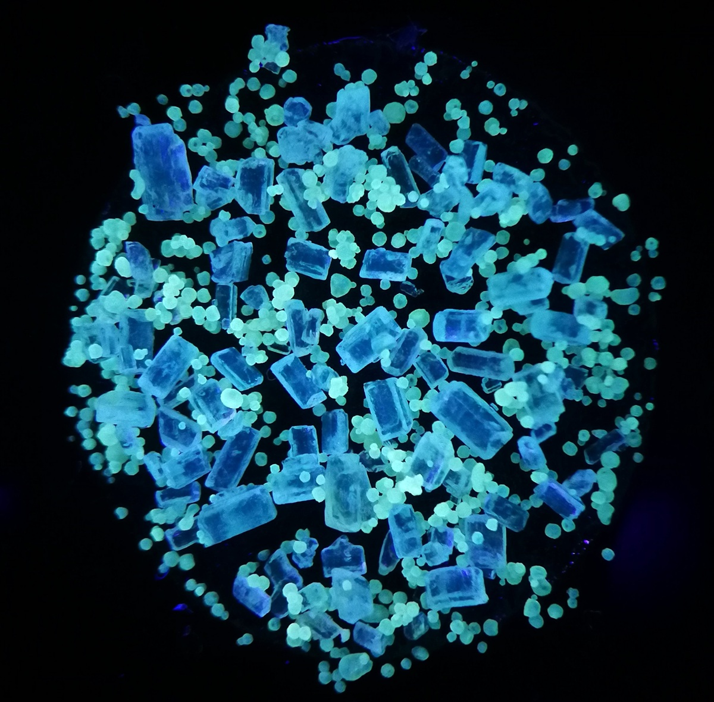

# Building Vision from Light: My Journey in Particle Detection R&D

When I first joined the research team, I didn't expect my work to involve sugar. I was a computer and electronics engineer — my world was circuits, software, sensors, and algorithms — not microscopes and particle samples. But the challenge that landed on my desk was too fascinating to ignore:

**Could we build a system that could see something invisible?**

Specifically, could we use cameras and light to detect Vitamin A particles in fortified foods — the kind added to everyday products like sugar and flour to combat micronutrient deficiencies? It was a bold idea: replace slow, liquid chemical testing with a small optical device and some clever software.

That was the beginning of a long, winding journey — part science experiment, part engineering adventure — that taught me more about problem-solving, persistence, and physics than any project before it.

---

## The Challenge: Seeing What Isn't There

The premise was simple: Fortified foods contain tiny Vitamin A compounds, suspended in a uniform mixture. In theory, under specific wavelengths, you can excite these compounds with light, causing them to re-emit energy as fluorescence from their conjugated double bonds. A camera could capture that glow and analyze it to detect—and even quantify, using advanced statistical models—the Vitamin A concentration. Instantly. Without a laboratory.

But theory is the easy part.

In practice, we were trying to extract meaningful data from noise, light scatter, and materials that were anything but consistent. It was a perfect storm — a problem that sat right between software, optics, and human nutrition.

My task: Make the software brain that tied it all together.

---

## Stage 1: Building Vision from Light

The first hurdle was **calibration**. When identifying faint fluorescent signals, lighting becomes everything. A single flicker, a slight color imbalance, or even ambient room light could throw off the entire reading.

I designed a dynamic calibration module to stabilize the imaging process. It handled:

- **White balance normalization**, ensuring that every image started from a neutral baseline
- **Gamma correction**, to compensate for uneven light intensity across the sample
- **Hue–saturation–value (HSV) conversion**, which made it easier to isolate spectral components of interest — far more robust than working in raw RGB

Once the lighting was under control, I implemented a **background subtraction layer**, using rolling averages of sample frames to remove residual reflections from sugar crystals. It wasn't glamorous, but that small adjustment made a world of difference in accuracy.

Every captured image passed through this preprocessing stage before moving into the detection pipeline. In essence, we taught the system how to "see" the scene under identical conditions every time — as if it were working in a perfectly lit lab, even when it wasn't.

---

## Stage 2: Detecting the Signal

After calibration came the real test: **identifying the Vitamin A particles themselves**.

Under the right wavelength, they emitted a faint, consistent glow — so faint that it often blurred into the crystalline structure around it. My job was to write algorithms capable of teasing that glow out of the chaos.

### Adaptive Thresholding

The pipeline I built used several layers of adaptive thresholding. Instead of relying on fixed brightness cutoffs, it calculated dynamic thresholds based on histogram peaks — essentially letting each image decide for itself what "bright" and "dark" meant. This was crucial because samples varied so much between tests.

### Morphological Operations

Once potential particles were highlighted, the software performed **morphological operations** — small mathematical filters that erode noise, smooth edges, and connect broken shapes. I used a combination of erosion–dilation cycles, tuned kernel sizes, and region labeling to isolate true signals.

### Statistical Classification

Each candidate region then passed through a rule-based classifier that measured:

- Mean and peak intensity
- Size and circularity ratios
- Variance across color channels

If a region matched the statistical profile of known Vitamin A fluorescence, it was logged as a detection event.

From there, I built a **statistical aggregation model** that counted and normalized detections per surface area, creating a rough concentration map. The result wasn't just a yes/no flag — it was a quantified estimate, something that could later feed into compliance reporting or batch-level analysis.

For the first time, the system was turning pixels into chemistry.

---

## Stage 3: Reality Checks and Limits

After months of development and dozens of sample batches, the prototype was finally ready for testing. We ran it on fortified sugar samples with known concentrations of Vitamin A, comparing its readings against standard laboratory results.

The early runs were thrilling. The software picked up clear fluorescence on high-dose samples, the data lined up beautifully, and the whole workflow felt like it was finally clicking.

Then we started testing standard, real-world fortification levels — and that's when **physics pushed back**.

### The Hard Truth

Vitamin A exists in such tiny quantities in properly fortified food that the fluorescent signal becomes vanishingly small — buried beneath layers of optical scatter and noise. Even the best algorithms in the world can't amplify what isn't measurable in the first place.

Through analysis, I calculated that to achieve a statistically significant reading, the imaging surface would need to be **roughly sixty-four times larger** (the size of your typical bedroom) than our test bed (essentially the size of a tabletop scanner). At that scale, the idea of a small, portable device no longer made sense.

It was a sobering but valuable moment. We hadn't built a failed system — we had built a working system that revealed the true physical limits of the problem.

---

## Stage 4: Lessons in Engineering and Curiosity

That realization changed how I think about engineering. In software, you often assume that enough optimization or computing power can eventually solve a problem. In physical systems, that's not always true. **Sometimes nature draws a hard boundary** — and your job is to find out where it is.

### Transferable Innovation

Yet, the project was anything but a dead end. The algorithms we developed had broader applications: particle detection, fluorescence imaging, and adaptive segmentation — all transferable to other scientific and industrial uses. More importantly, the work demonstrated the value of bringing computational thinking into fields that traditionally rely on laboratory science.

### Engineering as Translation

I started to see engineering not just as a way to build tools, but as a **language** — one that can translate between disciplines. The same methods I used to detect Vitamin A could just as easily be used to:

- Track impurities in manufacturing
- Study fluorescence in biology
- Enhance visual analysis in environmental monitoring

### The Value of Understanding

The project also taught me a more personal lesson: that **curiosity is a valid outcome in itself**. We didn't walk away with a market-ready solution, but we walked away with understanding — the kind that reshapes how you approach every problem after it.

---

## Looking Back

When I think about that time now, I remember the small victories: the first clean detection map after a week of noisy outputs, the moment the segmentation pipeline finally separated particles accurately, the first time the system ran end-to-end without manual tuning. Those little breakthroughs made the long nights worth it.

It was, in many ways, **pure engineering** — a blend of code, physics, and persistence chasing a question that didn't have an easy answer.

Working on particle detection taught me patience, precision, and respect for the limits of measurement. It also reminded me that innovation doesn't always mean producing a finished product — sometimes it means mapping the edges of what's possible so that others can push beyond them.

### What I Took Away

In the end, the journey mattered more than the outcome. I started out trying to make a machine see Vitamin A, but what I really learned was how to see the invisible connections between disciplines — how engineering, light, and biology can meet in unexpected ways.

That's what R&D really is at its best: **an exploration of the boundaries between what we know and what we can still discover**.

---

*This project bridged computer vision, optics, and nutritional science — a reminder that the most interesting engineering problems rarely fit into a single discipline.*
