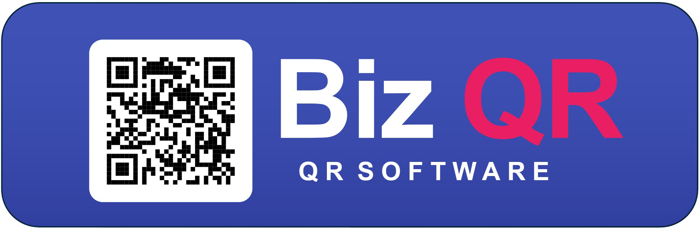
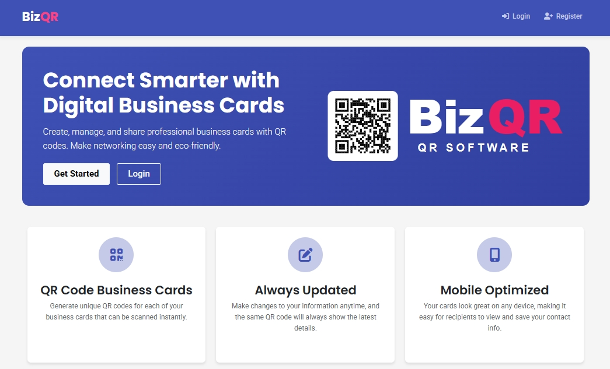
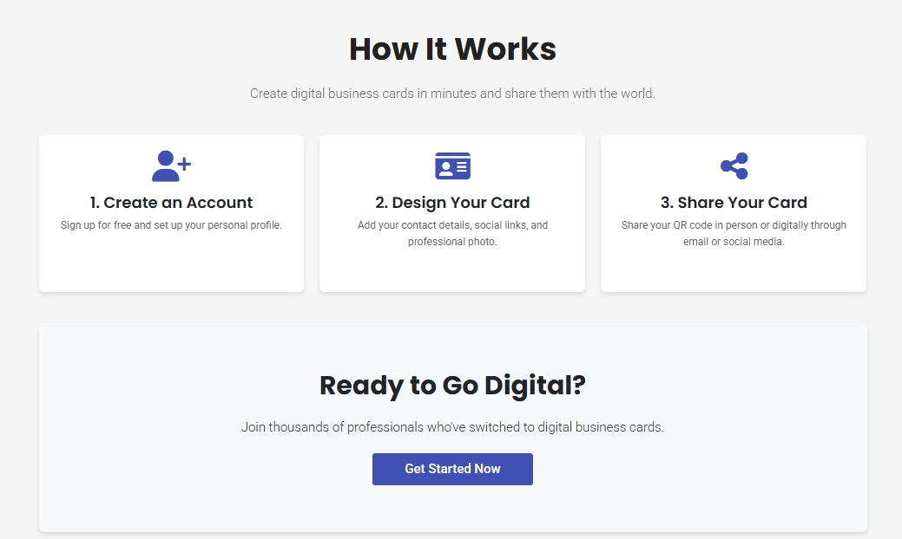
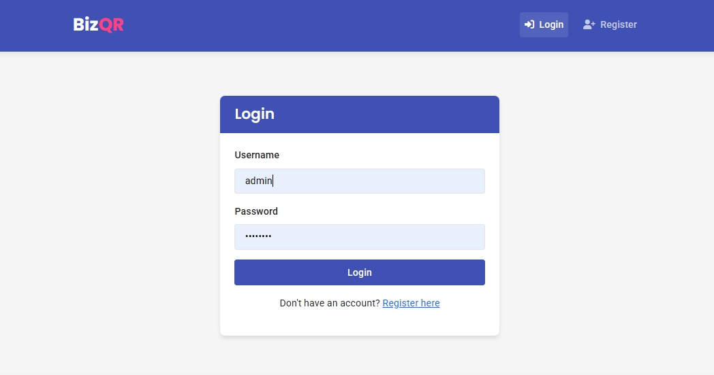
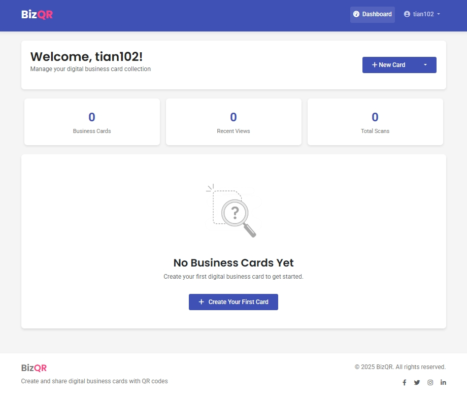
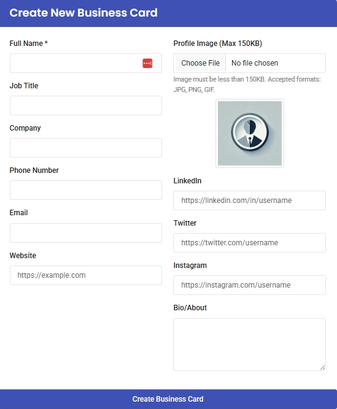
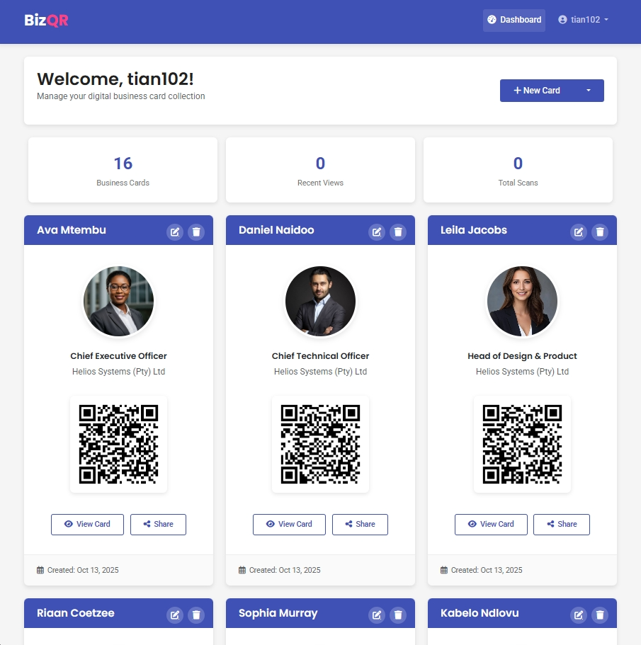

# BizQR - Digital Business Card Platform

## Why I Built This

I needed digital business cards. The kind with QR codes that people can scan at networking events. Simple enough, right?

But every service I looked at wanted a monthly subscription. $10, $15, even $30 a month—just to host what amounts to a contact page with a QR code. And if I ever stopped paying? All those QR codes I'd printed on flyers and business materials would point to... nothing.

That felt wrong. So I built BizQR over a few days—a self-hosted alternative where you own your data, your cards, and your QR codes. No subscriptions, no vendor lock-in, just a simple PHP app you can run on any cheap hosting.

## The Problem with online Business Cards platforms

Here's what bothered me about existing platforms:

- **Recurring Fees**: Monthly charges for what's essentially a static page
- **Vendor Lock-In**: Stop paying and your QR codes become useless
- **Limited Control**: You're stuck with their design, their features, their limitations
- **Privacy Concerns**: Your professional contacts live on someone else's server
- **Uncertain Future**: What if they shut down? Change pricing? Get acquired?

With BizQR, you host it yourself. You control everything. And it costs whatever your hosting costs—which for most people is either free (if you're already hosting something) or a few dollars a month.

## How It Works

The concept is dead simple:

1. **Create a card**: Fill in your name, title, company, contact info. Upload a profile pic if you want.
2. **Get a QR code**: Each card automatically generates a unique QR code and public URL.
3. **Share it**: Print the QR code on business cards, flyers, conference badges—whatever.
4. **Update anytime**: Change jobs? New phone number? Update once and the QR code still works.

The QR code never changes. The URL never breaks. Your contact info just stays current.

Oh, and visitors can download your info as a vCard file—one tap and you're in their phone's contacts. No app needed, no friction.

## Key Features

### For Users
- **Simple Registration**: Create an account and start building cards immediately
- **Card Management Dashboard**: View all your cards at a glance with quick access to edit or delete
- **QR Code Generation**: Each card automatically generates a scannable QR code
- **Public Profile Pages**: Clean, mobile-responsive card display optimized for quick information sharing
- **vCard Support**: One-click contact export for easy saving
- **Bulk Upload**: Create multiple cards at once via CSV import
- **Profile Images**: Upload custom photos or use default placeholder
- **Persistent Links**: Your card URL never changes, even when you update information

*Modern landing page highlighting key features*

### Technical Highlights
- **Self-Hosted**: Run on your own server, keep your data
- **Lightweight Stack**: PHP backend with MySQL database—simple, proven, reliable
- **Responsive Design**: Built with Bootstrap 5, works perfectly on mobile devices
- **Clean Code**: Well-organized structure with separation of concerns
- **Easy Deployment**: Drop in XAMPP/LAMP stack and run initialization script
- **No External Dependencies**: QR generation via API (can be swapped with local library if preferred)

## User Journey

### 1. Landing Page
The landing page introduces BizQR's value proposition with clear feature cards explaining the benefits of digital business cards.

*Landing page with feature showcase*

### 2. Authentication
Simple registration and login system. Create an account with username, email, and password—no complex onboarding, just the essentials.

*Clean login interface*

### 3. Empty Dashboard
New users see an empty dashboard with clear prompts to create their first business card. The interface includes options for single card creation or bulk CSV upload.

*Dashboard view for new users*

### 4. Card Creation
The card creation form is straightforward: enter your details, upload an optional profile image, and submit. The form validates input and handles image uploads securely.

*Card creation form with all necessary fields*

### 5. Dashboard with Cards
Once cards are created, the dashboard displays them in a card grid layout. Each entry shows a preview of the profile, job title, company, and the generated QR code. Quick action buttons allow editing or deleting cards.

*Dashboard showing created business cards*

### 6. Public Card View
The public-facing card is mobile-optimized and clean. It displays all contact information, profile photo, and provides a "Save Contact" button to download the vCard file.

*Public view of a digital business card*

## Technical Overview

### The Stack

**Backend**:
- **PHP**: Server-side logic and routing
- **MySQL**: Relational database for user and card data
- **PDO**: Secure database interactions with prepared statements

**Frontend**:
- **HTML5 & CSS3**: Semantic markup and modern styling
- **Bootstrap 5**: Responsive UI framework
- **JavaScript**: Form validation and interactivity
- **Font Awesome**: Icon library for visual elements

**Infrastructure**:
- **XAMPP/LAMP**: Local or production web server stack
- **QR Code API**: External API for QR generation (easily replaceable)

### Database Design

Simple but effective schema:

**users** table:
- User authentication and account management
- Hashed passwords for security
- Email and username uniqueness constraints

**business_cards** table:
- Card content (name, title, company, contact info)
- User ownership via foreign key
- Public ID for sharing (prevents sequential ID enumeration)
- Profile image path storage
- Timestamps for creation and updates

The relationship is one-to-many: one user can have multiple business cards.

### Architecture Highlights

**MVC-Inspired Structure**:
- `config/` - Database connection and initialization
- `includes/` - Reusable header/footer components
- `assets/` - CSS, JavaScript, images
- Root level - Page controllers (dashboard, create, edit, etc.)

**Security Considerations**:
- Password hashing with PHP's `password_hash()`
- SQL injection prevention via prepared statements
- Session-based authentication
- File upload validation (type, size)
- Public ID generation to prevent ID guessing
- Input sanitization on display

**Key Implementation Details**:

**Public ID Generation**: Each card gets a unique random string (not sequential database ID) for the public URL, preventing enumeration attacks.

**vCard Generation**: Dynamically creates vCard files server-side with proper formatting for contact import compatibility.

**Image Handling**: Uploaded profile images are stored in `uploads/` directory with validation for file types and size limits.

**Bulk Upload**: CSV parsing allows administrators to quickly create multiple cards, useful for organizations issuing cards to employees or members.

## Why PHP and MySQL?

Because they're boring. And boring is good.

I could have used the latest JavaScript framework, built a fancy GraphQL API, containerized everything with Docker, and deployed to Kubernetes. But for what? So I could host a contact page?

PHP and MySQL are:
- Available on every $5/month shared hosting plan
- Simple enough that anyone can deploy and maintain it
- Battle-tested for decades
- Overkill-free

I wanted something you could drop into a XAMPP folder and just... run. No build steps, no npm, no complicated setup. You copy the files, import the database, and you're done.

Sometimes the boring choice is the right choice.

## The Self-Hosting Philosophy

Here’s the thing: I prefer to keep my professional identity in my own hands.

It’s not about mistrust—it’s about independence. SaaS platforms are built around subscriptions, and their goals don’t always align with mine. They focus on recurring revenue; I just want my information to remain accessible—no strings attached.

With BizQR:
- You own the data
- You control the uptime
- You decide the features
- You're not a product

If you print 1,000 business cards with a QR code on them, you want to know that code will work five years from now. With BizQR, that's your choice, not a vendor's.

## Who's This For?

**Freelancers**: Create different cards for different contexts—consulting work, side projects, volunteer roles. One system, multiple professional identities.

**Small Businesses**: Issue cards to all employees without paying per-user fees. Everyone gets their own card, you keep your sanity.

**Event Organizers**: Make temporary cards for staff or speakers that you can delete after the event. No lingering subscriptions.

**Privacy-Conscious People**: Keep your contact info on your own server. You decide who has access to the data and for how long.

**Anyone Who Prints Things**: If you're printing QR codes on physical materials, you want them to work forever. BizQR gives you that control.

## What I Learned

### Simple Doesn't Mean Easy
Building something "simple" still requires getting the details right. Password hashing, SQL injection prevention, file upload validation—even a weekend project needs proper security.

### Users Want Boring Features That Work
No one asked for fancy animations or AI-powered contact recommendations. They wanted: upload info, get QR code, share it. The simpler the flow, the better.

### Self-Hosting Needs to Be Actually Easy
If deployment requires more than 5 steps, most people won't bother. I spent almost as much time simplifying the setup process as I did building the app.

### Database Schema Matters Early
I initially used sequential IDs in public URLs (like `/card.php?id=1`). Realized that lets people enumerate cards by just incrementing the ID. Switched to random public IDs. Planning this upfront would have saved the migration headache.

## Challenges and Solutions

### Challenge: QR Code Generation
**Problem**: Generating QR codes requires either a library or external service.

**Solution**: Used a free QR API for simplicity. Could be swapped with a PHP library (like PHP QR Code) for fully self-contained hosting if API dependency is a concern.

### Challenge: Public URL Structure
**Problem**: Using sequential database IDs in URLs allows enumeration (guessing other card URLs).

**Solution**: Generate random public IDs for each card. URLs look like `/card.php?id=abc123xyz` instead of `/card.php?id=1`.

### Challenge: Image Uploads
**Problem**: File uploads can be a security risk (malicious files, oversized uploads).

**Solution**: Validate file types (only images), limit file size, use unique filenames, store outside web root when possible.

### Challenge: vCard Compatibility
**Problem**: Different devices and apps have varying vCard format support.

**Solution**: Used vCard 3.0 format with standard fields that work across iOS, Android, and desktop applications.

## Could It Be Better?

Sure. I could add:
- Analytics (track QR scans)
- Custom themes (different colors/layouts)
- Social media links (LinkedIn, Twitter, etc.)
- Custom domains (vanity URLs)
- Team management features

But honestly? It does what it needs to do. You make a card, you get a QR code, people scan it. Mission accomplished.

I'd rather have a simple thing that works than a complex thing that almost works. Feature creep killed more projects than lack of features ever did.

## Links and Resources

- **GitHub Repository**: [github.com/tian102/BizQR](https://github.com/tian102/BizQR)
- **Full Documentation**: See README.md in the repository for installation and setup guides

## Final Thoughts

I built BizQR because paying a subscription to share my phone number felt absurd. It took a weekend to get working, another week to polish, and now it just... runs.

No monthly fees. No vendor lock-in. No "sorry, we're changing our pricing model" emails. Just a simple app that does one thing well: let you create and share digital business cards that you actually own.

Is it fancy? No. Does it use the latest framework? Nope. Does it solve a real problem without unnecessary complexity? Absolutely.

If you've ever felt weird about paying monthly just to host your contact info, or if the idea of your QR codes depending on some startup's viability makes you nervous, this might be what you're looking for.

Clone it, host it yourself, and never think about it again. That's the whole point.

---

**Tech Stack**: PHP • MySQL • Bootstrap • JavaScript • QR Codes

**Development Time**: ~2 weeks (mostly polish)

**Lines of Code**: ~2,500

*Built it because subscriptions for contact info felt wrong.*
